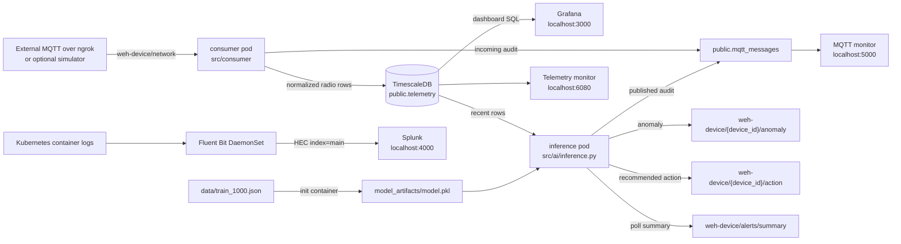

# DeviceDataHub Code Walkthrough

This document explains the DeviceDataHub repository from startup to runtime
behavior. It is intended as a reading path for someone joining the project:
start with the flow diagram, follow one telemetry message through the system,
then use the file map and package guide to study each component independently.

## 1. What the System Does

DeviceDataHub consumes Wi-Fi telemetry over MQTT, stores normalized radio
measurements in TimescaleDB, trains and runs an anomaly-detection model, and
publishes anomaly explanations back to MQTT. Grafana reads the telemetry table
for dashboards. Fluent Bit forwards Kubernetes application logs to Splunk.
Two small monitor pages read the same TimescaleDB data for operational debugging.

There are two input modes:

- **External MQTT mode:** the consumer connects to the configured ngrok/TCP MQTT
  endpoint.
- **Simulator mode:** Mosquitto and `src/ai/simulator.py` run in Kubernetes. The
  simulator publishes only input telemetry to `weh-device/network`; inference
  still generates the output messages after processing stored telemetry.

## 2. End-to-End Flow

The following diagram is the system overview. Arrows labelled `logs` are
observability paths, not business-data paths.



### Runtime sequence

1. `scripts/start_cloud.sh` finds the repository root from its own path.
2. The launcher pulls the existing Git checkout with `git pull --ff-only`.
3. Docker Engine is checked and started when needed.
4. `scripts/startup.py` creates or reuses the kind cluster.
5. The application image is built and loaded into kind. The image archive is
   stored temporarily under `.runtime/kind-tmp` to avoid kind `/tmp` failures.
6. Helm installs or upgrades the `ai-flow` release in namespace `devicedatahub`.
7. TimescaleDB starts first and exposes the `telemetry` database.
8. The consumer waits for the database, connects to MQTT, and subscribes to the
   configured input topic.
9. Each incoming message is recorded in `public.mqtt_messages`, validated, and
   converted into one or more Wi-Fi radio rows in `public.telemetry`.
10. The inference init container trains the model from `data/train_1000.json`.
11. The inference container loads the model and polls recent telemetry.
12. Anomalies are classified, explained, audited, and published to the three
    `weh-device` output topic families.
13. Grafana queries `public.telemetry`.
14. The monitor service queries both `public.mqtt_messages` and
    `public.telemetry` and serves the two local monitoring pages.
15. Fluent Bit reads Kubernetes container logs, adds Kubernetes metadata, and
    sends application events to Splunk HEC.

## 3. Read the Code in This Order

### Step 1: Read the configuration defaults

Start with:

- `helm/ai-flow/values.yaml`
- `helm/ai-flow/values.simulate.yaml`
- `config/.env.example`
- `requirements.txt`

These show the MQTT endpoints, database settings, model settings, Splunk
settings, simulator switch, storage sizes, and Python dependencies.

### Step 2: Read the launchers

Read these next:

1. `scripts/start_cloud.sh`: Linux/WSL entry point, Git pull, Docker startup,
   simulator prompt, startup invocation, service checks, and port-forward
   instructions.
2. `scripts/startup.py`: virtual environment, local Kubernetes tools, kind
   cluster, image build/load, Helm upgrade, Splunk credentials, and readiness
   recovery after a Helm timeout.
3. `scripts/shutdown.py`: Helm, namespace, kind, image, virtual environment,
   and legacy port-forward cleanup.

### Step 3: Follow one incoming message

Read:

1. `src/consumer/config.py` for environment-backed settings.
2. `src/consumer/consumer.py` for process and signal handling.
3. `src/consumer/client.py` for the MQTT callbacks.
4. `src/consumer/storage.py` for JSON extraction and SQL inserts.

### Step 4: Follow anomaly inference

Read:

1. `src/ai/data.py` for the feature list and training preparation.
2. `src/ai/train.py` for model training and serialization.
3. `src/ai/model_io.py` for `joblib` persistence.
4. `src/ai/db.py` for inference database reads and published-message audit writes.
5. `src/ai/inference.py` for scoring, reason codes, cooldowns, explanations, and
   output payloads.
6. `src/ai/mqtt_publisher.py` for MQTT connection and output topic publishing.

### Step 5: Read the deployment layer

Then read:

- `Dockerfile`
- `helm/ai-flow/templates/workloads.yaml`
- `helm/ai-flow/templates/database.yaml`
- `helm/ai-flow/templates/grafana.yaml`
- `helm/ai-flow/templates/monitor.yaml`
- `helm/ai-flow/templates/splunk.yaml`
- `helm/ai-flow/templates/log-forwarder.yaml`
- `helm/ai-flow/templates/config.yaml`
- `helm/ai-flow/templates/storage.yaml`

These files explain how Python processes become pods and how services, PVCs,
Secrets, ConfigMaps, probes, init containers, and RBAC are assembled.

## 4. MQTT Contracts

### Input telemetry

The consumer subscribes to the configured input topic, normally:

```text
weh-device/network
```

The expected payload is a JSON object containing a `network` list. Wi-Fi network
items contain a `radios` list, and each radio can contain `radio_stats` and
`clients`.

### Output topics

Inference publishes these topics:

```text
weh-device/{device_id}/anomaly
weh-device/{device_id}/action
weh-device/alerts/summary
```

The simulator does **not** publish these outputs. It only publishes input
telemetry to `weh-device/network`. This keeps simulated input separate from
model-generated decisions.

### Anomaly payload

The anomaly payload includes:

- `device_id` and `radio`
- event `timestamp`
- `anomaly_prob` and configured `threshold`
- `model_version`
- feature values and the original input row
- `reason`, `reason_code`, and `scenario`
- plain-language `layman_explanation`
- `recommended_action`
- the output `mqtt_topic`

The action payload contains the same decision context in a retained message.
The summary payload contains poll totals such as healthy rows, anomaly rows,
and published alert count.

## 5. Inference Reason Codes

The classifier checks conditions in this order, so the first matching rule wins:

| Code | Scenario | Main trigger |
| --- | --- | --- |
| `SEVERE_CONGESTION` | Severe congestion | Channel utilization or CCA busy is at least 90%. |
| `SEVERE_INTERFERENCE` | Severe interference | OBSS or interference utilization is at least 40%. |
| `CO_CHANNEL_CONGESTION` | Co-channel congestion | Same-channel AP count is at least 8, or strong same-channel AP count is at least 4. |
| `WEAK_CLIENTS` | Weak clients | Average RSSI is below -70 dBm, or weak-client count is at least 3. |
| `HIGH_RETRIES_OR_FAILURES` | High retry/failure rate | TX retries are at least 10, or TX failures are at least 2. |
| `HIGH_CLIENT_LOAD` | High client load | Client count is at least 20, or active-client count is at least 12. |
| `UNUSUAL_WIFI_CONDITIONS` | Fallback | The model flags an anomaly but no specific rule matches. |

The model must first classify the row as anomalous using `ALERT_THRESHOLD`,
which defaults to `0.5`. Healthy rows do not receive a reason code or output
alert.

## 6. Storage and Data Flow

### `public.telemetry`

Created by `TelemetryRepository.ensure_db()` in `src/consumer/storage.py`.
Important fields include:

- identity: `device_id`, `radio`, `ifname`, `network_type`
- time: `timestamp`
- radio conditions: channel, frequency, bandwidth, utilization, noise
- client conditions: counts, RSSI, SNR, rates, MCS/NSS
- reliability: retries and failures
- nested client data: `clients` JSONB

Grafana, inference, and the telemetry monitor all read this table.

### `public.mqtt_messages`

Also created by the consumer repository. It records:

- `direction`: `incoming` or `published`
- `topic`
- raw `payload`
- `succeeded`
- `created_at`

The MQTT monitor displays this table newest first. Incoming records are written
by the consumer. Published anomaly/action/summary records are written by the
inference publisher.

## 7. Deployment Walkthrough

### Docker image

`Dockerfile` creates a Python 3.12 slim image:

1. Installs `libgomp1`, required by LightGBM.
2. Installs `requirements.txt`.
3. Copies `src/` and `data/`.
4. Creates model and log directories.
5. Sets `PYTHONPATH=/app/src` so `consumer`, `ai`, and `ui` are importable.
6. Runs as the non-root `app` user.
7. Defaults to `python -m consumer.consumer`.

The same image is reused for the consumer, simulator, inference, training init,
and monitor deployments. External infrastructure uses its own images for
TimescaleDB, Grafana, Splunk, Mosquitto, and Fluent Bit.

### Helm values

`helm/ai-flow/values.yaml` is the default external MQTT profile. It enables:

- TimescaleDB and Grafana
- Splunk and Fluent Bit
- MQTT consumer and inference
- training init container
- monitor UI
- model/log/database/Splunk storage

`helm/ai-flow/values.simulate.yaml` overrides only the MQTT path:

- enables Mosquitto
- points consumer and inference to the in-cluster broker
- enables the simulator deployment
- keeps the same `weh-device/network` input topic and `weh-device` output base

### Kubernetes workload relationships

- **TimescaleDB StatefulSet:** durable PostgreSQL/TimescaleDB storage with a
  readiness probe.
- **Consumer Deployment:** waits for database access, then consumes MQTT.
- **Inference Deployment:** waits for database access, trains in an init
  container, then starts the inference loop.
- **Simulator Deployment:** optional input generator; publishes only telemetry.
- **Monitor Deployment:** serves port 5000 for MQTT history and container port
  6000 for telemetry. Startup exposes telemetry on host port 6080 because
  browsers commonly block host port 6000.
- **Grafana Deployment:** provisions the TimescaleDB datasource and dashboard.
- **Splunk Deployment:** Splunk Web on container port 8000 and HEC on 8088.
- **Fluent Bit DaemonSet:** reads pod logs and enriches them with Kubernetes
  metadata before sending HEC events.

### Startup recovery

`scripts/startup.py` uses Helm `upgrade --install --wait --timeout 30m`.
It checks whether an earlier release exists and reads its status. If a previous
operation recorded a deadline timeout, it checks existing pods before retrying.
If the current Helm command reports a deadline timeout, it waits up to another
30 minutes for all namespace pods to become Ready, including init containers,
before continuing. Other Helm errors remain fatal.

## 8. Script Walkthrough

### `scripts/start_cloud.sh`

This is the human-facing launcher:

1. Resolves its own repository root so checkout location does not matter.
2. Sets executable permissions on scripts.
3. Installs missing Ubuntu/Debian prerequisites where `apt-get` is available.
4. Verifies the checkout is a Git repository and pulls fast-forward-only.
5. Starts Docker Engine if necessary.
6. Creates/activates `.venv`.
7. Prompts for simulator mode.
8. Runs `scripts/startup.py`.
9. Waits for required Services.
10. Opens visible terminal windows for port-forwards when a graphical terminal
  is available. In a headless shell, the fallback starts detached forwards and
  writes their PID/log files under `.runtime`; it also prints manual commands.

### `scripts/startup.py`

Important functions:

- `ensure_venv()`: creates the venv and uses a SHA-256 stamp to skip unchanged
  requirement installation.
- `ensure_tools()`: finds or downloads kind, kubectl, and Helm into `.local/bin`.
- `ensure_cluster()`: creates, reuses, or recreates the kind cluster.
- `install_stack()`: builds/loads the image and invokes Helm.
- `splunk_values_file()`: asks for terms acceptance and writes owner-only local
  Splunk values.
- `check_existing_install()`: detects previous Helm statuses and pod readiness.
- `run_helm_upgrade()`: recovers from Helm deadline errors by waiting for every
  namespace pod to become Ready.

### `scripts/shutdown.py`

Removes Kubernetes and local resources. It stops tracked detached port-forward
processes and removes their runtime PID/log files. If a forward is running in a
foreground terminal, stop it with `Ctrl+C` in that terminal.

## 9. Python Modules: File-by-File

### `src/consumer/`

#### `src/consumer/config.py`

- Calls `load_dotenv()` for optional local `.env` use.
- Defines the frozen `Settings` dataclass.
- Reads MQTT, database, QoS, keepalive, and logging values from environment
  variables.
- `get_settings()` caches one settings object with `lru_cache`.

#### `src/consumer/consumer.py`

- Provides the process entry point with `main()`.
- Installs SIGINT/SIGTERM handlers.
- Creates `MqttTelemetryConsumer` and calls `connect()`.
- Disconnects cleanly on shutdown.

#### `src/consumer/client.py`

- Creates the Paho MQTT v2 client.
- Subscribes to the configured input topic on connect.
- Decodes each message and records the raw incoming event.
- Validates JSON object shape and extracts Wi-Fi radio rows.
- Persists valid rows through `TelemetryRepository`.
- Runs the MQTT loop until shutdown.

#### `src/consumer/storage.py`

- Creates the telemetry table and MQTT audit table.
- Converts timestamp formats to UTC.
- Converts optional numeric values safely.
- Walks `network -> radios -> radio_stats` payloads.
- Inserts normalized rows into `public.telemetry`.
- Inserts raw message direction/topic/payload records into `public.mqtt_messages`.
- Retries database initialization during pod startup.

### `src/ai/`

#### `src/ai/data.py`

- Defines `ML_FEATURE_COLUMNS`.
- Loads JSON training rows and labels.
- Loads optional CSV training data.
- Selects available numeric feature columns and fills invalid values with zero.

#### `src/ai/db.py`

- Creates PostgreSQL connections for inference.
- Uses TimescaleDB-compatible SQL to fetch the newest row per device/radio.
- Applies lookback and scan windows so stale rows do not trigger inference.
- Records published MQTT payloads in `public.mqtt_messages`.

#### `src/ai/inference.py`

- Loads the serialized model and metadata.
- Converts database values to JSON-safe values.
- Scores recent telemetry rows.
- Applies the anomaly threshold and cooldown.
- Maps features to reason codes and explanations.
- Writes detailed anomaly case files under `logs/anomalies`.
- Publishes anomaly and action events through `MQTTAlertPublisher`.
- Publishes a retained poll summary.

#### `src/ai/model_io.py`

- Small `joblib.dump()` and `joblib.load()` wrappers.
- Keeps model persistence separate from training and inference logic.

#### `src/ai/mqtt_publisher.py`

- Creates the outbound MQTT client.
- Connects/reconnects to the alert broker.
- Publishes to:

```text
weh-device/{device_id}/anomaly
weh-device/{device_id}/action
weh-device/alerts/summary
```

- Records every publish attempt in TimescaleDB.

#### `src/ai/simulator.py`

- Generates normal or anomalous-looking Wi-Fi input payloads.
- Publishes only to `weh-device/network`.
- Does not publish model alerts or actions.
- Reconnects to Mosquitto after failures.

### `src/ui/`

#### `src/ui/monitor.py`

- Starts HTTP servers for the MQTT page and telemetry page.
- `/mqtt` and `/api/messages` expose incoming/published MQTT history.
- `/telemetry` and `/api/telemetry` expose TimescaleDB rows.
- Supports 5-minute, 15-minute, 1-hour, 24-hour, and all-time filters.
- Sorts newest first and provides load-older pagination.
- Refreshes browser data every 30 seconds.

## 10. Python Dependencies

The runtime image installs all entries in `requirements.txt`:

| Package | Used by | Why |
| --- | --- | --- |
| `paho-mqtt` | consumer, simulator, inference publisher | MQTT connections, subscriptions, and publishing. |
| `python-dotenv` | consumer configuration | Loads optional local `.env` values. |
| `psycopg[binary]` | consumer storage, monitor UI | Modern PostgreSQL driver with binary support. |
| `psycopg2-binary` | inference database access and Kubernetes DB wait init | PostgreSQL compatibility for inference and lightweight init checks. |
| `pandas` | training, inference | Tabular telemetry, feature frames, and row conversion. |
| `numpy` | inference | Numeric conversion, anomaly scores, and NaN/finite handling. |
| `scikit-learn` | training | Splitting data, scaling, classification metrics, and IsolationForest fallback. |
| `lightgbm` | training | Supervised anomaly classifier. |
| `joblib` | model I/O | Serializes trained model/scaler metadata. |

The Dockerfile also installs system package `libgomp1`, required by the LightGBM
runtime.

## 11. Configuration Map

| Configuration | Main consumer | Inference/publisher | Simulator | Helm source |
| --- | --- | --- | --- | --- |
| Input MQTT host/port | `MQTT_BROKER_HOST`, `MQTT_BROKER_PORT` | N/A | `SIMULATOR_MQTT_HOST`, `SIMULATOR_MQTT_PORT` | `mqtt.*`, `simulator.*` |
| Input topic | `MQTT_TOPIC` | N/A | `SIMULATOR_MQTT_TOPIC` | `mqtt.topic`, `simulator.topic` |
| Output base | N/A | `MQTT_BASE_TOPIC` | N/A | `alerts.baseTopic` |
| Database | `DB_*` | `TS_*` / `DB_TABLE` | N/A | `database.*` |
| Model | N/A | `MODEL_PATH` | N/A | `training.modelPath` |
| Detection | N/A | `ALERT_THRESHOLD`, `POLL_INTERVAL_SECONDS`, `WINDOW_MINUTES`, `POLL_LOOKBACK_MINUTES` | N/A | `inference.*` |
| Splunk | N/A | N/A | N/A | `splunk.*`, `logForwarder.*` |

## 12. Helm File-by-File

### `helm/ai-flow/Chart.yaml`

Declares the chart metadata and chart version.

### `helm/ai-flow/values.yaml`

Defines the normal external-MQTT profile, images, ports, credentials, storage,
resource requests, inference settings, Splunk, Fluent Bit, and monitor settings.

### `helm/ai-flow/values.simulate.yaml`

Overrides MQTT, alerts, broker, and simulator values for the local Mosquitto
profile. It does not change output topic semantics.

### `helm/ai-flow/templates/_helpers.tpl`

Defines reusable Helm names and labels.

### `helm/ai-flow/templates/broker.yaml`

Conditionally creates the Mosquitto ConfigMap, Service, and Deployment when
`broker.enabled` is true. This is enabled by the simulator values profile.

### `helm/ai-flow/templates/config.yaml`

Creates application credentials, Splunk defaults, and Grafana ConfigMaps.

### `helm/ai-flow/templates/database.yaml`

Creates the TimescaleDB Service and StatefulSet with its readiness probe and
persistent storage mount.

### `helm/ai-flow/templates/storage.yaml`

Creates PVCs for model, logs, TimescaleDB, Grafana, and Splunk data.

### `helm/ai-flow/templates/grafana.yaml`

Creates the Grafana Service and Deployment. It mounts the provisioned datasource,
dashboard provider, and dashboard JSON.

### `helm/ai-flow/templates/workloads.yaml`

Creates the consumer, optional simulator, inference, training init container,
and database wait init containers.

### `helm/ai-flow/templates/splunk.yaml`

Creates the Splunk Web/HEC Service and Deployment. It mounts persistent Splunk
data and installs the packaged DeviceDataHub dashboard app during pod init.

### `helm/ai-flow/templates/splunk-dashboard.yaml`

Creates the ConfigMap containing Splunk app metadata, navigation, and the
Simple XML pod-log dashboard.

### `helm/ai-flow/templates/log-forwarder.yaml`

Creates Fluent Bit ConfigMap, ServiceAccount, ClusterRole, binding, and
DaemonSet. It reads container logs, enriches Kubernetes fields, filters the
project namespace, excludes feedback-loop pods, and sends JSON HEC events.

### `helm/ai-flow/templates/monitor.yaml`

Creates the monitor Service with ports 5000 and 6000 and the monitor Deployment
that waits for the database tables before serving both pages.

### `helm/ai-flow/files/splunk/app.conf`

Marks the DeviceDataHub Splunk app enabled and visible.

### `helm/ai-flow/files/splunk/default.xml`

Sets `pod_logs` as the app’s default landing view.

### `helm/ai-flow/files/splunk/default.meta`

Sets read access for the dashboard view and app objects.

### `helm/ai-flow/files/splunk/pod_logs.xml`

Defines the Simple XML dashboard: time picker, pod dropdown, live log table,
10-second search refresh, and `_json` Kubernetes metadata fields.

### `helm/ai-flow/files/timescaledb.yml`

Grafana datasource configuration mounted into Grafana.

### `helm/ai-flow/files/dashboard.json`

Grafana dashboard definition packaged inside the Helm chart.

### `helm/ai-flow/files/mosquitto.simulate.conf`

Mosquitto configuration packaged for simulator mode.

## 13. Remaining Files

### `docker-compose.yml`

Optional local Compose path for TimescaleDB, consumer, trainer, inference,
Grafana, and the monitor UI. Kubernetes/Helm is the primary supported runtime.

### `config/.env.example`

Template for a root `.env` file used by Compose and optional Python local runs.
It is not loaded directly by Kubernetes Helm.

### `grafana/dashboard.json`

Repository copy of the Grafana dashboard used by Grafana provisioning.

### `grafana/provisioning/dashboards/dashboards.yml`

Tells Grafana to load dashboard JSON files from its mounted dashboard directory.

### `grafana/provisioning/datasources/timescaledb.yml`

Local/Compose Grafana datasource definition for TimescaleDB.

### `config/mosquitto.simulate.conf`

Repository copy of the Mosquitto simulator configuration.

### `ARCHITECTURE.md`

Component diagrams, startup sequence, data contracts, and the relationship
between Grafana, Splunk, the monitor pages, and the MQTT/TimescaleDB flow.

### `DESIGN_REQUIREMENTS.md`

Functional/non-functional requirements, operational interfaces, reason-code
definitions, and validation criteria.

### `README.md`

Primary operator guide for Linux/WSL startup, service URLs, Splunk searches,
manual port-forwards, monitoring pages, and shutdown.

### `README.simulate.md`

Simulator-specific behavior, input topic, generated telemetry, output topic
contracts, and simulator-focused Splunk searches.

### `workshop_prerequistes.md`

Workshop setup guide split into Windows/WSL2, native Linux, and common setup
paths, followed by operations and troubleshooting.

### `data/train_1000.json`

Canonical labeled training dataset. Each row provides telemetry features and a
`label` used by `src/ai/train.py`.

### `model_artifacts/model.pkl`

Tracked/generated model artifact location used by local workflows. Kubernetes
training writes the active model to the model PVC.

### `.dockerignore`

Prevents virtual environments, Git metadata, Helm files, Grafana files, local
tools, and runtime state from entering the application image build context.

### `.gitignore`

Excludes local virtual environments, generated runtime files, credentials, and
local Kubernetes tooling from Git.

### `.gitattributes`

Forces LF endings for shell and Python files so Windows checkouts do not create
CRLF execution failures.

## 14. Practical Study Exercises

A newcomer can work through these small experiments:

1. Change `ALERT_THRESHOLD` and observe how anomaly volume changes.
2. Enable simulator mode and inspect `public.mqtt_messages` for incoming rows.
3. Open the telemetry monitor and compare its rows with Grafana panels.
4. Open the Splunk pod-log dashboard and filter the inference pod.
5. Add a temporary print in `classify_reason()` and watch inference logs.
6. Change a simulator metric and predict which reason code it should trigger.
7. Run `helm template` and inspect the generated Deployments, Services, Secrets,
   PVCs, and DaemonSet.
8. Run the syntax/lint checks before committing.

## 15. Validation Commands

```bash
bash -n scripts/start_cloud.sh
python3 -m py_compile scripts/startup.py scripts/shutdown.py
helm lint helm/ai-flow --set splunk.acceptLicense=true \
  --set splunk.adminPassword=WorkshopTest123! \
  --set splunk.hecToken=01234567-89ab-cdef-0123-456789abcdef
helm template ai-flow helm/ai-flow --namespace devicedatahub \
  --set splunk.acceptLicense=true \
  --set splunk.adminPassword=WorkshopTest123! \
  --set splunk.hecToken=01234567-89ab-cdef-0123-456789abcdef >/tmp/ai-flow.yaml
```

For runtime validation:

```bash
kubectl get pods -n devicedatahub -o wide
kubectl get services -n devicedatahub
kubectl get pvc -n devicedatahub
```

Expected application flow:

```text
MQTT input -> consumer -> TimescaleDB
TimescaleDB -> inference -> weh-device/{device_id}/anomaly
TimescaleDB -> Grafana and telemetry monitor
Kubernetes logs -> Fluent Bit -> Splunk
```
